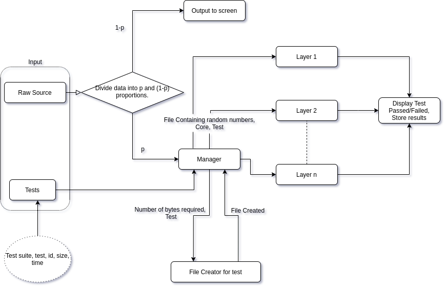
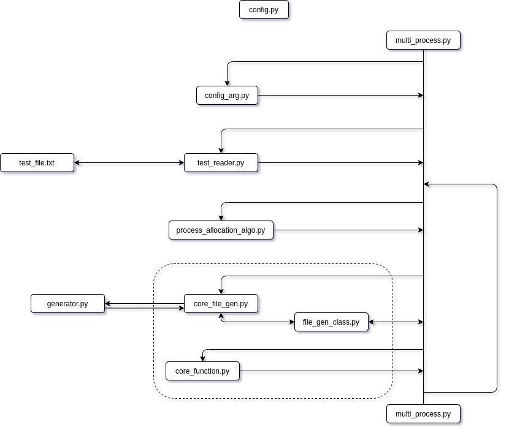

# Random Numbers Testing Module

This module is created as part of masters thesis at IIIT Delhi and University of Delhi. Parts of code are from [Randomness Statistics Batteries](https://github.com/crocs-muni/rtt-statistical-batteries).

## Installation

- clone random\_number\_testing\_module.
- run Install.
- write function in generator.py, according to your random number generator.
- run multi\_process.py

## Description(Parameters)
 
- [-n] Number of iterations to run over the test file (Default - Infinite, exits with Ctrl-C).
- [-t] Path of tests file (Required).
- [-d] Destination to store results (Default - results/).
- [-c] Number of cores to be allocated to the module. 1 core is allocated to the file generation module and n-1 are used for testing (Default - 4).
- [-td] Path to store temporary file (Default - temp/). 
- [-m] Threshold to file size(in bytes) for generator.py to create (Default - 1010 Bytes).

## Flow chart

## Architecture

- **config.py**
&nbsp;&nbsp;&nbsp;
The file contains information about all the parameters present in test\_file.txt.

- **config\_arg.py** 
&nbsp;&nbsp;&nbsp;
The file takes user input for different tunings in the module.

- **test\_reader.py** 
&nbsp;&nbsp;&nbsp;
It reads the tests in the test\_file.txt and provide the list to multi\_process.py.

- **test\_file.txt** 
&nbsp;&nbsp;&nbsp;
It contains a list of tests to run over random number generator.

- **process\_allocation\_algo.py** 
&nbsp;&nbsp;&nbsp;
The function tries to equally partition all the tests to the cores, according to their execution time.

- **core\_file\_gen.py** 
&nbsp;&nbsp;&nbsp;
It generates a binary file containing random number according to the need with the help of generator.py.

- **generator.py** 
&nbsp;&nbsp;&nbsp;
It is a user defined function which generates binary random files, when file name and its size is provided to it.

- **file\_gen\_class.py** 
&nbsp;&nbsp;&nbsp;
This class helps core\_file\_gen.py to keep track of which file is required next.

- **core\_function.py** 
&nbsp;&nbsp;&nbsp;
This is testing function, which is identical to all the cores, it has the information of how to run the test when details of the test and file is provided to it.

- **multi\_process.py** 
&nbsp;&nbsp;&nbsp;
This is the main file which handles the module.

